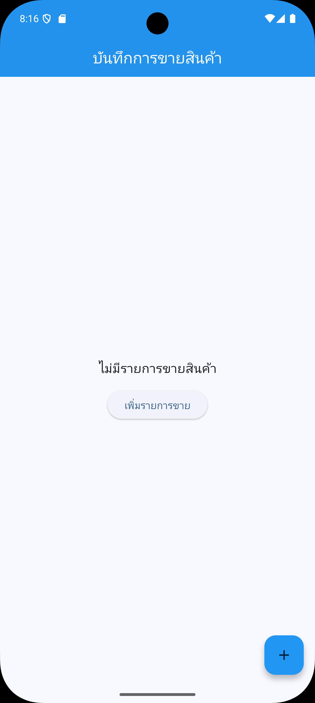
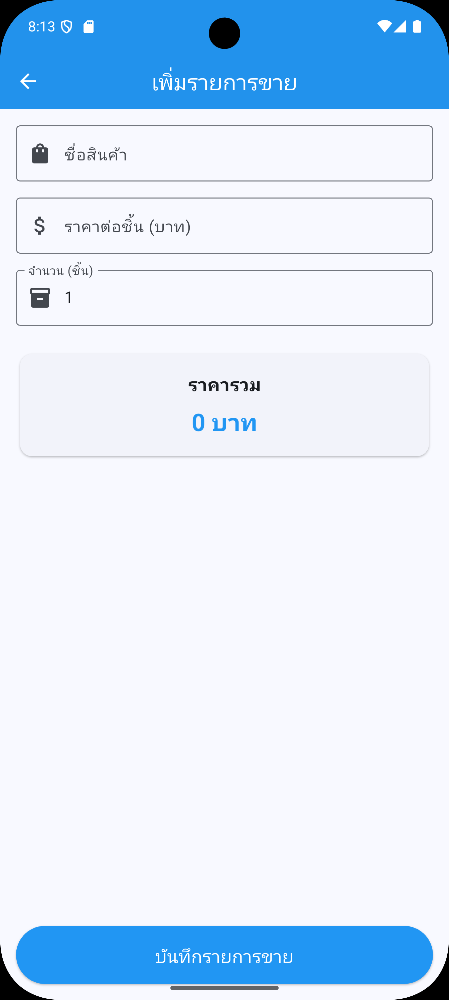
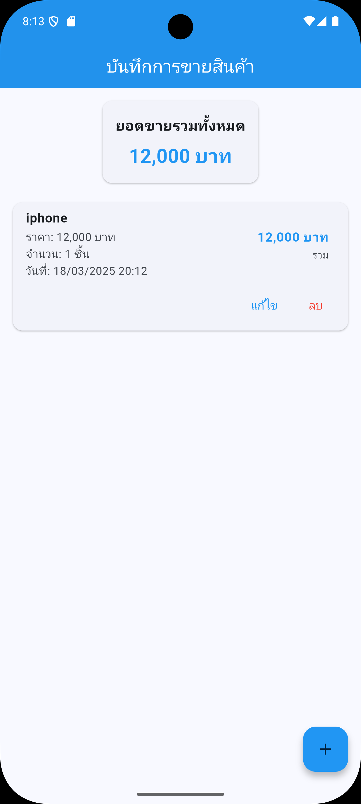

# Mobile App Final Exam Project - Sales Management System

A comprehensive Flutter mobile application with Python Flask backend for managing product sales and inventory. This application was developed as a final exam for the Mobile Application Development course.

## Project Overview

This sales management system is designed for mobile app final exam

## Screenshots

Here are some screenshots of the application:

| Home Screen | Add Sale | Sales Details |
|-------------|----------|---------------|
|  |  |  |


## Key Features

- **Product Sales Management**: Record new sales with product details, price, and quantity
- **Automatic Calculation**: Total price calculated automatically based on quantity and unit price
- **Sales History**: View complete chronological history of all sales transactions
- **Data Analytics**: Track total revenue and sales statistics
- **CRUD Operations**: Create, read, update, and delete sales records
- **Responsive UI**: Modern, user-friendly interface with smooth animations
- **Data Persistence**: Local storage with MySQL database

## Technology Stack

### Frontend (Flutter)
- **Framework**: Flutter 3.29.2
- **State Management**: Provider pattern
- **HTTP Client**: HTTP package for API communication
- **UI Components**: Flutter Material Design, Flutter Slidable
- **Local Storage**: Shared Preferences

### Backend (Python)
- **Framework**: Flask
- **Database**: MySQL
- **API**: RESTful API endpoints
- **Cross-Origin Support**: Flask-CORS

## Project Requirements

- **Flutter SDK**: >=3.6.0 <4.0.0
- **Dart SDK**: >=3.6.0 <4.0.0
- **Python**: 3.x
- **MySQL**: 5.7 or higher

## Installation and Setup

### Backend Setup

1. Make sure Python 3.x is installed on your system
2. Install required Python packages:
   ```
   pip install flask flask-cors mysql-connector-python
   ```
3. Configure MySQL connection in `server.py` if needed:
   ```python
   DB_CONFIG = {
       'host': 'localhost',
       'user': 'root',
       'password': '', 
       'database': 'dbshop'
   }
   ```
4. Run the Flask server:
   ```
   python server.py
   ```
   The server will run on http://0.0.0.0:5000

### Backend Implementation

The backend of this application is implemented in `server.py` using Python Flask. The server provides a RESTful API for the Flutter frontend to interact with the MySQL database.

### Server Features

- **Database Initialization**: Automatically creates the required database and tables if they don't exist
- **RESTful API**: Implements CRUD operations for sales management
- **Cross-Origin Resource Sharing**: Enabled with Flask-CORS for seamless frontend-backend communication
- **Error Handling**: Comprehensive error handling for database operations and API requests
- **JSON Serialization**: Proper formatting of data for API responses

### Server Code Structure

The `server.py` file contains:

1. **Database Configuration**: MySQL connection settings
2. **Database Initialization**: Setup code for creating the database and tables
3. **API Endpoints**: Flask routes for handling different HTTP requests
4. **Data Validation**: Validation of request data before processing
5. **Error Handling**: Proper error responses with appropriate HTTP status codes

### Running the Server

The server can be started with:

```
python server.py
```

It will run on `0.0.0.0:5000`, making it accessible from both localhost and other devices on the network.

### Flutter App Setup

1. Ensure Flutter is installed (version 3.29.2 recommended)
2. Clone the repository or download the project files
3. Navigate to the project directory
4. Install dependencies:
   ```
   flutter pub get
   ```
5. Configure the API endpoint in the app if needed:
   - For Android emulator: `http://10.0.2.2:5000/api`
   - For physical device: `http://<your-computer-ip>:5000/api`
   - For iOS simulator: `http://localhost:5000/api`
6. Run the app:
   ```
   flutter run
   ```

## Database Structure

The application uses a MySQL database with the following structure:

**tbsale Table**:
- `id` (INT, Primary Key): Unique identifier for each sale
- `productName` (TEXT): Name of the product sold
- `productPrice` (INT): Price per unit of the product
- `amount` (INT): Quantity of products sold
- `totalPrice` (INT): Total price of the sale (productPrice × amount)
- `createdAt` (TIMESTAMP): When the sale was recorded

## API Endpoints

The backend provides the following RESTful API endpoints:

- `GET /api/sales` - Retrieve all sales records
- `GET /api/sales/<id>` - Get a specific sale by ID
- `POST /api/sales` - Create a new sale record
- `PUT /api/sales/<id>` - Update an existing sale record
- `DELETE /api/sales/<id>` - Delete a sale record
- `GET /api/total` - Get the total sales amount

## Project Structure

```
lib/
├── main.dart              # Application entry point
├── models/                # Data models
│   └── sale_model.dart    # Sale data model
├── providers/             # State management
│   └── sale_provider.dart # Sale state provider
├── screens/               # UI screens
│   ├── home_screen.dart   # Main screen with sales list
│   └── sale_form_screen.dart # Form for adding/editing sales
├── services/              # Backend communication
│   ├── api_service.dart   # API client for server communication
│   └── sale_service.dart  # Business logic for sales
├── utils/                 # Utility functions and helpers
└── widgets/               # Reusable UI components
```


## Learning Outcomes

Through this project, the following concepts were applied:
- Mobile application development with Flutter
- RESTful API design and implementation
- Database design and management
- State management in Flutter applications
- User interface design for mobile applications
- Full-stack development integration


## Resources

- [Flutter Documentation](https://docs.flutter.dev/)
- [Flask Documentation](https://flask.palletsprojects.com/)
- [MySQL Documentation](https://dev.mysql.com/doc/)
- [Provider Package](https://pub.dev/packages/provider)
- [HTTP Package](https://pub.dev/packages/http)
